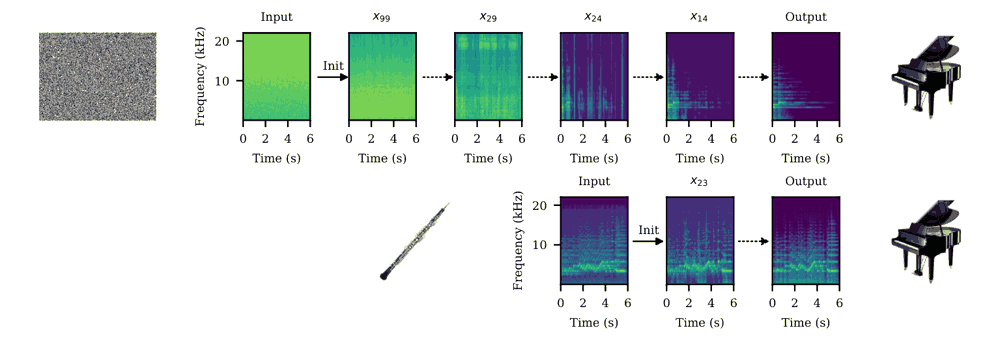

# 精读笔记：Audio-to-Audio via Diffusion Warm Initialization

阅读日期：2026-10-08。依据用户提供的 8 页 PDF，并核对 arXiv 2606.18968v1 源码。本文中的玩具数值均为教学示意，未运行模型、未试听音频。

## 基本情况与导读地图

Cristóbal Andrade、Sebastian J. Schlecht，德国 FAU，DAFx 2026。输入是引导音频及目标文本，输出是转换或增强后的音频。核心贡献是推理时改变扩散起点，不需要针对转换任务重新训练。基础模型是 Stable Audio Open；论文展示项目页，未核实到本文独立的完整实现或专用权重。

| 部分 | 原文位置 | 阅读问题 |
|---|---|---|
| 动机 | PDF p1，§1 | 怎样保留旋律，同时改变音色？ |
| 架构 | p2–3，算法1、图1 | 引导信号究竟在哪一步进入？ |
| 训练 | §2.1–2.2 | 为什么零任务训练也能工作？ |
| 数据 | §4.1 | FAD 的参考分布是真实钢琴吗？ |
| 信息流与例子 | 算法1、图2 | τ 与实际反向步数是什么关系？ |
| 实验与局限 | 图3–7、§5 | 哪些结果只是探索性演示？ |

## ① 动机：把已有生成模型变成转换器

例如把一段双簧管独奏换成钢琴。直接文本生成钢琴不会保留原曲；训练专用转换网络又需要数据和额外模型。作者的选择是从原音频附近开始反向扩散，使预训练模型改变声音特征，同时尽可能保留原来的音符结构。关键假设是引导信号可能接近某个中间概率分布，但论文没有证明这一假设对所有音频成立。



图1上半部分从纯噪声生成钢琴，下半部分从双簧管进入中间状态；虚线表示反向扩散步骤。图中的频谱是观察结果的方式，不代表 Stable Audio Open 直接以这些显示频谱为模型输入。

## ② 架构：起点控制与文本引导分工

引导音频提供要保留的结构；文本条件把生成过程拉向目标声音。复用已有去噪模型和采样器，增加的是初始化逻辑和超参数选择。论文用 VE 表述，α_t=1；实际基础模型工作在其音频表示空间，论文没有给出足够实现细节让人把算法变量直接当成任意长度的原始波形数组。

| 模块 | 更新参数？ | 作用 |
|---|---|---|
| Stable Audio Open 的表示与去噪网络 | 否 | 提供已有音频生成先验 |
| 暖初始化 | 无参数 | 从引导信号进入中间步骤 |
| CFG | 否 | 用文本控制目标分布 |
| 反向采样器 | 无新训练 | 从起点继续生成 |

论文实验使用提示 Grand Piano, Chords and Melodies，T=100、CFG ω=30；FAD 参考集用 ω=7 生成，二者口径不同（§3.1、§4.1）。因此摘要里的“无任务条件”应理解为不训练专用条件网络，不能理解为实验完全不用文本条件。

## ③ 训练：本文没有新的任务训练

基础扩散模型已学习音频分布。本文只修改推理起点：

```text
t_init = ceil((1 − τ_init) × T)
x_start = x_guide + λ × σ(t_init) × ε
随后从 t_init 反向采样到 0
```

τ 是跳过的反向轨迹比例，范围0–1；λ 是额外噪声比例；σ 是基础模型噪声调度；ε 是高斯噪声。τ 越大，实际执行步骤越少，通常越保留输入。λ=0 表示直接使用引导表示；这不是删除去噪网络，也不是取消迭代。

数值示意：T=100、τ=0.8，按实数数学得到 t_init=20。λ=0 时不添加额外随机噪声。实现 ceil 时需留意浮点误差，别把这个教学计算当成已核实的官方代码输出。

## ④ 数据：输入样本与评估样本

一条样本可写为“引导音频、目标文本、τ、λ、ω、随机种子”。没有新的训练配对集。核心双簧管音频来自 MUSOPEN。每个设置生成50条用于 JD 的均值和标准差；FAD 比较100条暖初始化输出与100条基础模型生成的钢琴（p4）。附录补充弦乐到单簧管。

重要区别：FAD 的钢琴参考不是本文采集的真实钢琴录音；它衡量接近模型生成参考分布的程度，不能直接等同真实录音真实性。

## ⑤ 输入输出信息流

```text
引导音频 → 基础模型要求的音频表示 x_guide
目标文本 → 文本条件
τ、T → t_init；λ、σ、ε → x_start
x_start → 带文本CFG的反向扩散，执行剩余步骤
最终表示 → 基础模型的解码路径 → 输出音频
```

正文没有公开精确潜变量形状、分段策略和推理时延，不能自行补成固定张量尺寸。暖初始化和 CFG 是不同控制：前者决定改动起点，后者决定目标牵引强度。二者可能相互影响，不能只调一个就宣称稳定保留旋律。

## ⑥ 例子走一遍：双簧管变钢琴

1. 取双簧管片段，将其转成基础模型接受的表示。
2. 设目标钢琴文本，T=100、τ≈0.8、λ=0、ω=30。
3. 从约20步位置出发，第一次去噪得到更靠近目标分布的表示，再以它为下一步输入继续迭代；原引导信号不需要每一步重新注入。
4. 解码并检查是否保留旋律、是否变成钢琴；若更像钢琴但原音符被改写，则尝试更晚起点，即增大τ。若保留双簧管过多，则尝试减小τ。该方向来自算法与曲线，不是普适保证。

教学 JD：输入音高集合 A={60,64,67}，输出 B={60,64,69}，交集2、并集4，JD=1−2/4=0.5。即使音符顺序、时值、八度表达存在问题，集合指标仍可能看起来好；它不能完整评价旋律忠实度。

## ⑦ 实验、矛盾与局限

图3–4显示后期起点提高旋律忠实度但降低目标分布贴合；本文设置中τ≈0.8是经验工作区，JD<0.6、FAD<0.7是作者的经验参考，换模型不能照搬。额外加噪通常提高幻觉事件，并未明显改善目标分布贴合。MIDI-to-real、去噪、去削波等主要是示例与非正式试听，不能当成全面受控基准结果。

**原文矛盾**：图2图注写“小 t_init 改动更强”，但算法定义、§3.1及图3–4的趋势支持“实际反向步数越多，改动通常越强”。复现时优先以算法明确的 t_init=ceil((1−τ)T) 和曲线解释为准，并记录图注冲突。

作者承认：人声/哼唱转换较差；源分离尤其鼓声抑制失败；τ、λ、CFG都敏感；没有理论选择准则。读者还应注意单旋律集合JD不能覆盖节奏及多声部，FAD存在生成参考和CFG不一致问题。

## 代码对应与来源

暂无可核实的本文完整官方代码，因此以上信息流和示例是基于算法1的讲解，不是已运行复现。

- [论文与版本](https://arxiv.org/abs/2606.18968)
- [作者项目页](https://cristobalandrade.github.io/Audio-to-Audio-via-Diffusion-Warm-Initialization/)
- 原始PDF、完整高分辨率材料若未随本目录提供，具体原因见 `upload-status.md`。
