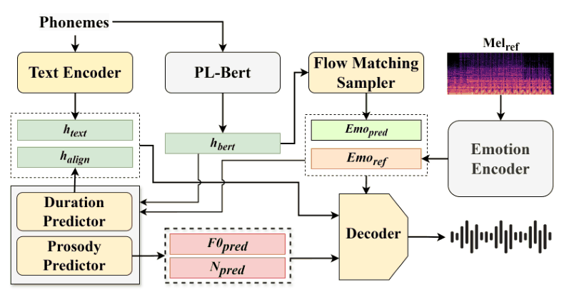

# 精读笔记：EFTTS

阅读日期：2026-10-08。依据用户提供的 APSIPA ASC 2025、6页PDF，DOI 10.1109/APSIPAASC65261.2025.11249123。Haoyu Wang、Jiale Chen、Jiaxun Li、Sizhe Shan、Yuehai Wang，浙江大学。未运行模型，示意向量不是模型输出。

## 基本情况与导读地图

输入文字及情绪标签，或文字及情绪参考语音；输出情感语音。本文在 StyleTTS2 框架中，使用 Emotion2Vec 表征情绪，并用 CFM 生成128维句子级情绪向量。它不是用 flow matching 直接生成完整语音声学序列。

| 部分 | 原文位置 |
|---|---|
| 动机 | p1–2，§I |
| 架构 | p2–3，§II、图1–2 |
| 训练 | p3–4，式1–5、§III-A |
| 数据 | p3–4，ESD与处理参数 |
| 信息流及例子 | 图2、p4–5式6 |
| 实验与局限 | p4–5，表I–IV |

## ① 动机：既保留情绪细节，也适应新文本

同为 Happy，不同句子的重音、语速、音高不应一样。固定标签向量容易把丰富表现平均掉；直接提取参考风格又可能混入说话人及内容，硬套到新句子。作者用冻结的预训练情绪表征提供细节目标，并让文字条件参与情绪向量生成。

一个具体需求是把“我们终于完成了”说得高兴：目标文字确定说什么，Happy 确定方向，参考录音提供具体表现。本文赌的是在低维情绪空间先建模，再驱动韵律与波形，比直接从头训练参考编码器更有效。所谓解耦是作者的设计目标，不等于已证明表征完全不含说话人信息。

## ② 架构：CFM作用在情绪向量



图2从上方音素开始：左侧文本编码器提供内容，PL-BERT提供韵律文本表示；右侧参考语音经过 Emotion Encoder；中间 Flow Matching Sampler 生成预测情绪。二者混合后进入时长、韵律及波形生成链。底部输出的是波形。

| 模块 | 来源、更新 | 作用 |
|---|---|---|
| Emotion2Vec base | 预训练、冻结 | 提取句子级情绪表征，线性投影到128维 |
| PL-BERT | 预训练、冻结 | 为音素提供韵律相关文字表征 |
| ASR与pitch extractor | 预训练、冻结 | 训练时取得对齐、F0及能量监督 |
| 情绪CFM | 训练 | 根据文字/情绪条件生成情绪向量 |
| LSTM时长、韵律预测 | 训练 | 预测duration、F0、能量 |
| 改进ISTFTNet解码器 | 训练 | 从对齐内容和情绪直接生成波形 |
| MPD/MRD | 对抗训练 | 多周期、多分辨率音质监督 |

情绪通过AdaIN进入下游模块。AdaIN可以理解为用条件向量控制特征的缩放与平移；不是把128维向量复制成“128种情绪”。论文没有完整列出各模块参数量或说话人条件的独立接口，不能补成已证实的任意声音克隆系统。

## ③ 训练：预测流向，再联合优化声音

```text
L_joint = L_mel + L_dur + L_F0 + L_energy + L_CFM + L_GAN
L_CFM = E ||v_θ(x_t,t,c) − u_t(x_t|c)||²
```

x_t是中间情绪向量；c含文本及情绪标签；v是预测速度；u是目标概率路径速度。CFM学的是如何从噪声走到情绪分布。论文式5没有完整指定可复现的路径/网络细节，不能把某个通用线性流实现当成作者确定实现。

教学示意：若目标速度u=[2,−1]、预测v=[1.5,−0.5]，平方误差和为0.25+0.25=0.5；优化让预测方向靠近目标。这里2维替代真实128维，且例子不是论文样本。

4张RTX4090D、100 epochs、batch16；AdamW，学习率5e−5、β1=0、β2=0.99、weight decay1e−4。论文报告训练NFE随机1–4，推理固定3；NFE是向量场函数评估次数，不应直接等同语音只生成3帧，也不能据此宣称总时延（p4）。

## ④ 数据：一条样本有哪些字段

ESD英文部分：10位说话人×5种情绪×350句=17,500条，约每位1.2小时。五类为Neutral、Happy、Angry、Sad、Surprised。文字用Phonemizer保留重音和标点；监督梅尔80bin，STFT窗/FFT1024、hop256。

| 字段 | 表示 | 用途 |
|---|---|---|
| 文本、音素 | 可变长度序列 | 内容及PL-BERT输入 |
| 波形 | 一维采样序列 | 情绪表征与波形监督 |
| 情绪标签 | 五类之一 | CFM条件 |
| 时长 | 音素级 | 对齐及duration监督 |
| F0、能量 | 时间序列 | 韵律监督 |
| 情绪表征 | 投影后128维 | CFM目标与生成条件 |

原文对“每个说话人每情绪20条用于validation/test”的措辞不足以恢复两个集合各自的精确大小；不要擅自写成与Emo-DPO相同的1000/1500划分。没有公开读到真实dataset实现，样本表是根据论文整理。

## ⑤ 信息流：标签生成与参考迁移

```text
标签模式：音素 → 内容表示、PL-BERT表示
         高斯噪声 + 文本表示 + 情绪标签 → CFM/ODE → e_pred(128)
         e_pred + 文本表示 → 时长、F0、能量 → 对齐内容 → 波形

参考迁移：参考语音 → Emotion2Vec/投影 → e_ref(128)
         文本条件CFM → e_pred(128)
         e_mix = β e_pred + (1−β)e_ref → 同一下游合成链
```

参考表征提取一次；CFM采样要按ODE多次评估；最后只把生成的情绪向量送入语音生成器，不沿每个声学帧独立生成情绪轨迹。论文部分措辞把参考输入与CFM混写，图2和式6可明确两条表征支路，但具体条件拼接实现仍未给出。

## ⑥ 例子走一遍：参考情绪适应新句子

设目标句为“我们终于完成了”，给一段高兴参考录音。教学缩成2维：e_ref=[0.8,0.2]，e_pred=[0.4,0.6]；β=0.5时e_mix=[0.6,0.4]。这两个坐标没有“开心度/音高度”的已知物理定义，只用于展示向量混合。

随后时长预测器确定音素持续多久，内容按时长展开，韵律预测器产生F0和能量，解码器结合e_mix生成波形。改变β是在参考表达与文字相关生成表征之间折中；β越大不等于情绪越强。真实实现是128维；论文实验在β=0.5处效果最好，但未提供任意文本和未知情绪上的保证。

## ⑦ 实验与严谨解读

表II标签生成：EFTTS nMOS4.13、eMOS4.16、MCD4.87、ERA81.40%；EmoDiff为3.76/3.62/5.98/68.77%，EmoSphere为3.92/3.96/5.63/72.34%。表III参考迁移：4.14/4.18/4.83/95.33%。两任务条件不同，95.33%不能替代标签生成的81.40%。

表IV去掉Emotion2Vec：nMOS−0.26、情绪MOS−0.33、MCD+0.46、ERA−15.67%；去CFM影响较小，但不是不需要参考的比较。这里百分号应保留原表口径，绝对变化解读通常是百分点。

注意：t-SNE分簇不证明彻底解耦；训练/评估均利用Emotion2Vec家族，需防表征指标偏好。英文ESD规模很小；未给出明确speaker-disjoint划分，零样本跨说话人迁移不能自动扩展为任意未见说话人声音克隆。论文称“human-level”，但ground truth的MOS更高，没有等效性检验，证据支持“优于所选基线”，不足以支持普适人类水平。表I/II标题与裁图索引存在误定位，已按PDF核对。

## 官方材料与代码范围

[作者demo](https://bigbroes.github.io/EFTTS/)有架构及音频样例；核查时未找到本文完整官方训练实现及专用权重发布。不能把StyleTTS2或Emotion2Vec的开放性当作EFTTS已完整开源。上传范围见 `upload-status.md`。
