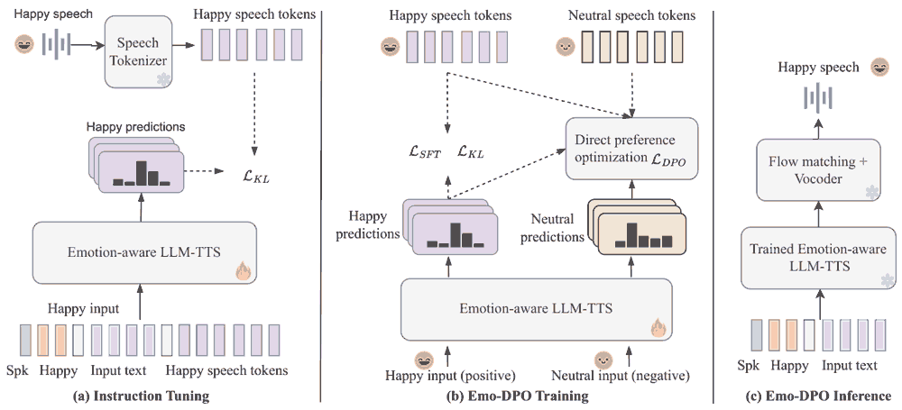

# 精读笔记：Emo-DPO

2026-10-08阅读。依据用户提供的5页PDF及 arXiv 2409.10157v1（2024-09-16）。Xiaoxue Gao等，A*STAR、NUS。会议最终状态不从源码文件名推断。未运行模型，数值例子是教学示意。

## 基本情况与导读地图

输入文字、目标情绪和说话人x-vector；输出情感语音。核心贡献是在CosyVoice系LLM-TTS上先做指令微调，再以同文字不同情绪的正负语音token做偏好优化。流匹配及vocoder在后端且冻结，不是DPO直接优化波形或流场。

| 部分 | 原文位置 |
|---|---|
| 动机 | p1、§I |
| 架构 | 图1、§II-A |
| 训练 | §II-B/C、p2–3公式 |
| 数据 | §III-A |
| 信息流与例子 | 图1、偏好样本模板 |
| 实验与局限 | p4图2–3、表I–II |

## ① 动机：让模型学习哪些输出不符合情绪要求

普通监督训练告诉模型“文字+Happy应该对应这段语音”。偏好训练进一步提供“同一句话的Neutral输出不符合当前Happy要求”。这里的preferred与dispreferred由目标情绪定义，不是把Neutral普遍视为低质量，也不是有人工逐条标注好听程度的RLHF数据。

场景是把“我们终于完成了”说得高兴：正样本是高兴录音，负样本是同文字别的情绪录音。相同文字使比较更聚焦情绪，但不自动控制说话人、时长及录音差异；论文文字明确相同text，却没有完整说明每个偏好对的所有其他变量都受控。

## ② 架构：LLM预测语音token，后端负责声音



图1三列：左侧SFT用情绪指令学习正确语音token；中间用正负token序列训练偏好；右侧推理只保留训练好的LLM-TTS，后接冻结flow matching与vocoder。负样本只用于训练，不需要在推理时先生成两条语音再选择。

| 模块 | 来源/更新 | 作用 |
|---|---|---|
| 文字编码、TTS-LLM | CosyVoice-300M-Instruct初始化，情绪适配 | 自回归预测语音token |
| speech tokenizer | 既有预训练 | 训练语音转离散token目标 |
| reference policy π_sft | SFT阶段结果，DPO比较基准 | 限制对基线的相对偏移 |
| flow matching | 预训练、冻结 | 从语音token取得声学结果 |
| HiFiGAN | 预训练、冻结 | 声学结果转波形 |

300M是基础模型命名，不能写成论文所有模块参数量之和；tokenizer固定目标提取器，正文未逐项公开完整可训练参数清单。

## ③ 训练：相对参考模型的成对概率比较

阶段1样本模板为 `E.<endofprompt>text</s>speech_tokens</s>`，训练2epochs。阶段2构造相同文字、相同情绪指令，正确情绪token为y+，其他情绪token为y−，DPO训练3epochs、batch8、4GPUs。

```text
r+ = log π(y+|E,text) − log π_sft(y+|E,text)
r− = log π(y−|E,text) − log π_sft(y−|E,text)
L_DPO = −log sigmoid(β × (r+ − r−))
J = softplus(r+) − softplus(r−)
本文用 logits = r+ − r− − J 替换原始差值
L_total = α L_DPO + γ L_KL + θ L_SFT
```

α=γ=θ=1。β控制偏好强度，文中未提供足以独立复现实验的明确值；不要补成0.1“默认论文设置”。π、π_sft的概率针对整个token序列，通常来自token对数概率累加；论文没有交代长度归一化策略，需复现时核查。

教学例：r+=0.4、r−=−0.2、β=1。普通DPO的logit0.6，loss≈0.437；本文J≈0.913−0.598=0.315，修正logit≈0.285、loss≈0.561。这只是展示修正确实改变目标；不是论文采用β=1的证据。

作者称该修正JS divergence manipulation，应按所给表达式讨论，不能把它不加证明地等同标准概率分布Jensen–Shannon散度。SFT/KL项保持正样本拟合，降低只追求相对差值引起的漂移；DPO不保证每步都同时升高正样本绝对概率并降低负样本绝对概率。

另一个原文问题：阶段1KL式左侧写KL(P_π||P)，右侧却使用目标概率p与log(p/p_π)，方向措辞不一致；复现需以具体代码确认，不能只照左侧符号选择反向KL。

## ④ 数据：偏好来自平行情绪录音

ESD英文10说话人、5情绪、每人每情绪350句，共17,500条；train15,000、valid1,000、test1,500（每人每情绪300/20/30）。五类Neutral、Angry、Happy、Sad、Surprise。

| 字段 | 意义 |
|---|---|
| text与目标emotion | 正负样本共享的条件 |
| speaker x-vector | 保持声音身份 |
| y+ | 符合emotion的语音token序列 |
| y− | 同文字的不同emotion语音token序列 |
| π_sft的序列分数 | 参考概率比 |

论文测试说话人的x-vector来自训练数据，不能称speaker-disjoint未知声音测试。所用偏好不是线上生成器采样后由人类评价；它来自带情绪标签的录音配对。因此该方法依赖可构造的负例，不是没有额外监督的信息增益。

## ⑤ 信息流

```text
训练：录音 → tokenizer → y+ / y−
      text + emotion + speaker → 可训练LLM与参考LLM
      两组序列log-prob → DPO/修正 + KL/SFT → 更新情绪TTS策略

推理：text + emotion + speaker → LLM逐token生成
      语音token → 冻结flow matching → 冻结vocoder → 波形
```

自回归token链和流匹配声学链不是同一个时间轴。偏好只影响前者的分布；后者仍依赖原有token-to-acoustics映射。本文未报告完整推理latency，不能据“LLM300M”推算实时率。

## ⑥ 例子：Happy相对Neutral

给Happy指令和同一句文字，选快乐录音为y+、中性录音为y−。先编码两条录音，得到长度可能不同的token序列。训练读取各token的条件概率，累加出序列分数；参考模型对同样序列评分，得到r+与r−；按上式更新当前模型。

推理时不给这两条目标录音，只给文字、Happy与speaker x-vector。例如教学token前缀为[11,28]，下一token由LLM按前缀和条件产生，再逐步续写至终止；这些编号完全是示意，不具有可核实的声学含义。token完整后由冻结流匹配及vocoder合成。训练中“拒绝Neutral”不代表测试时不能生成Neutral：当目标标签改成Neutral，正负关系也会改变。

## ⑦ 实验：更明显的收益在韵律及主观评价

表I相对CosyVoice，EmoSIM98.73→98.87、ProsodySIM3.69→3.89、WER4.94→4.54。图2 MOS3.16→3.84、EmotionMOS3.38→4.24。图3相对CosyVoice偏好Emo-DPO88.7%、偏好CosyVoice10.6%（余项四舍五入），主观测试20人、MOS每系统30条，AB每组仅8条。

表II去DPO后EmoSIM仍98.87，ProsodySIM降3.64、WER升4.94。因此不能把所有改善都归因DPO，指令微调与正则同样参与。还有消融WER4.52比完整4.54略低，完整模型不是所有指标绝对最好。Happy识别准确率与CosyVoice同为0.60，也不是每类都改善。

限制：单一小规模表演数据、未见说话人证据不足、情绪标签形式负例不能代表真实细微偏好、长度/说话人混杂、β与KL实现不清、主观样本少且图未呈现完整统计不确定性。不能把EmoSIM98.87当成98.87%情绪分类准确率；它是相似度口径，表中分类准确率另列。

## 代码与来源

核查到[官方demo](https://xiaoxue1117.github.io/Emo-tts-dpo/)，未确认本文完整DPO训练仓库和专用权重。CosyVoice基础代码公开，不等于本文训练改动公开。以上代码对应依据图1与论文公式，未虚构文件行号。[论文](https://arxiv.org/abs/2409.10157)。上传范围见 `upload-status.md`。
