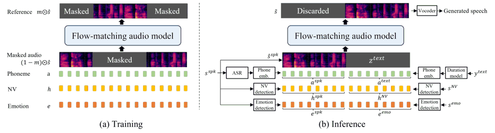

# 精读笔记：EmoCtrl-TTS / Laugh Now Cry Later

2026-10-08阅读。依据用户提供的8页PDF，核对 arXiv 2407.12229 与官方评估代码。Haibin Wu等，台湾大学与Microsoft；SLT2024。未运行合成或评估，例子中的控制数值均为教学示意。

## 基本情况与导读地图

输入目标文字、说话人参考、非语言发声参考、情绪参考；输出保留音色且可沿时间变化情绪、包含笑哭等发声的语音。四个接口的音频可以来自同一条源语音。模型本身是TTS模块；语音翻译实验还需要ASR、翻译和时长对齐。

| 部分 | 原文位置 |
|---|---|
| 动机 | p1、表1 |
| 架构 | p2–3、图1、§3.1–3.3 |
| 训练 | §2.2、p5的§4.3 |
| 数据 | §3.4、§4.1、表2 |
| 信息流与例子 | §3.1.2、EMO-change构造 |
| 实验与局限 | 表3–7 |

## ① 动机：一句话中情绪可以变化

一句话可以前半段平静、后半段激动，还夹着笑声；单个Happy/Sad标签没有明确的时间结构。另一个场景是把中文哭泣语音翻译成英文，文字变了，声音身份和情绪变化仍希望保留。作者用低维连续情绪轨迹及NV轨迹共同控制声学生成，而不只增加全局风格标签。

关键直觉是“把说什么、谁在说、每一段怎么说分别提供”。但分开的输入接口不保证完全统计解耦；论文观察到不合适的NV条件会引入多说话人笑声、降低文本正确性。

## ② 架构：以帧级条件补全梅尔



图1左侧训练：上方参考梅尔被mask，下方四排是上下文声学、音素、NV及情绪条件；中间网络填补被遮挡区域。右侧推理把说话人参考放在前段、待生成内容放在后段；生成后丢弃前段，只把新生成部分送给vocoder。

| 条件/模块 | 尺寸或来源 | 作用 |
|---|---|---|
| 音素a | D_phn×T，强制/时长对齐 | 保持文字内容 |
| 梅尔上下文 | F×T | 保持说话人声音 |
| NV h | 32×T，预训练laughter detector | 表示笑声及其他非语言发声 |
| 情绪e | 2×T，arousal/valence预测器 | 控制兴奋度及正负情绪 |
| 音频生成网络 | 24层Transformer、16heads、hidden1024、FFN4096 | 条件流匹配声学补全 |
| MelGAN-based vocoder | 既有解码器 | 梅尔转波形 |

情绪检测器每0.5秒窗口、0.25秒hop提取两个值；从[0,1]减0.5到[−0.5,0.5]，再插值到声学帧。arousal不是Happy概率：高兴和愤怒都可能高arousal，但valence相反。dominance被实验排除。NV向量来自笑声检测器，作者发现它还能表征哭声和呻吟；不应据此宣称已覆盖一切NV类别。

## ③ 训练：补全任务与连续概率流

```text
学习 P(mask⊙mel | (1−mask)⊙mel, a, h, e)
L_CFM = E ||u_t(x|x1) − v_θ(x,t,conditions)||²
```

mask标出待补全声学区域；u是目标速度，v是Transformer预测速度，优化的是速度误差而非情绪类别交叉熵。论文采用optimal-transport条件路径：均值t×x1、标准差1−(1−σ_min)t。推理从噪声通过ODE走向目标声学序列。

教学示意取σ_min≈0、x0=0.2、x1=1.0、t=0.5，则路径点约0.6、目标速度0.8；若预测0.7，平方误差0.01。真实对象是F×T的声学数组，不是两个情绪数本身。

先在Libri-light预训练390k steps，不给NV/情绪条件；再加入情感与笑声数据微调，通常40k、较长版本200k。有效batch307,200 audio frames，峰值学习率7.5e−5，预训练warmup20k。最终数据比例LL:IH-EMO:LAUGH=0.5:0.4:0.1。推理CFG1.0、NFE32。这里论文CFG定义不能未经换算直接比较别的库guidance参数。

## ④ 数据：规模主要来自筛选，不是人工逐帧标注

LL约60k小时、超过7000说话人；LAUGH460小时，来自AMI、Switchboard、Fisher的带笑声转录片段；IH-EMO从200k小时内部匿名英文音频筛出约27k小时。筛选顺序为Emotion2Vec情绪预测、DNSMOS OVLR>3.0、去除说话人切换、ASR转录。Neutral/Happy采用更严格的置信度1.0阈值，以缓和类别失衡（§3.4）。

| 一条训练样本字段 | 形状/单位 |
|---|---|
| 语音与文字 | 波形、可变长转录 |
| 梅尔与mask | F×T |
| 对齐音素 | D_phn×T |
| NV特征 | 32×T |
| 情绪轨迹 | 2×T，范围[−0.5,0.5] |

不能把27k小时都算成笑哭数据，也不能把匿名内部数据当成公开语料。训练中对IH-EMO主要使用情绪条件，对LAUGH主要使用NV条件，因为错误共用条件会伤害生成。评估JVNV日→英1615条；EMO-change84条合成情绪切换参考；真实中文笑声154条、哭声33条（表2）。后两项规模较小。

## ⑤ 输入输出信息流

```text
说话人参考 → mel_spk、ASR音素、h_spk、e_spk
目标文字 → duration/对齐 → a_text(D_phn×T_text)
NV参考 → h_NV(32×T_text)，长度不同时插值
情绪参考 → e_emo(2×T_text)，长度不同时插值
四条条件沿时间拼接[reference ; generated]
CFM噪声区域 + 已知参考区域 → ODE声学补全
丢弃参考区域 → 新梅尔 → vocoder → 波形
```

源日语参考可同时提供三种声音条件，翻译后的英文控制文字。线性插值只是按长度重映射；它不是词语语义对齐，不能保证日语某词的情绪恰落到对应英文词。

## ⑥ 例子：前半开心，后半悲伤

论文EMO-change的真实设置是将两种情绪的 kids are talking by the door 拼接，再让模型生成重复两次的 dogs are sitting by the door。这是有意控制文字与情绪的实验，不是自然对话中的完整情绪转折。

教学缩成4帧：e=[(0.3,0.4),(0.3,0.4),(−0.2,−0.4),(−0.2,−0.4)]。第一维兴奋度、第二维valence；前两帧高兴且激动，后两帧低兴奋且负向。h是另一个32维轨迹，不能用一个笑声布尔标志完全替代。

文本先对齐成4帧；说话人梅尔在前段作为上下文；生成区初始化噪声。第一次向量场评估预测整个生成区的更新方向；下一次使用更新后的声学状态及同样条件，再重复到完成。最终丢弃参考声学前缀，只输出目标句。真实帧数依时长而变，4帧仅为了说明信息流。

## ⑦ 实验与局限

JVNV表3：长微调P2相对同数据普通Voicebox B6，AutoPCP3.17→3.50、EmoSIM0.659→0.697、Aro-ValSIM0.470→0.643；WER3.0%→3.2%，有轻微代价。EMO-change上Aro-ValSIM0.655→0.811，但EmoSIM0.678→0.679几乎不变；各指标并非一致大幅提升。

表4主观JVNV：P2 NMOS3.53±0.13、EMOS3.66±0.15；ELaTE3.43±0.14、3.68±0.15。不能宣称情绪MOS显著超过ELaTE。哭声测试表7，P2 Aro-ValSIM0.597高于B6的0.413，但WER7.5%高于5.1%；情绪控制与可懂度存在真实权衡。

限制还包括内部数据不可直接复现、伪标签误差、短窗口情緒估计粗糙、长短句插值的时间错位。论文“arbitrary NV”是能力表述，不是所有发声都获得系统验证。

## 代码核查：开放的是评估工具

官方仓库 [EmoCtrlTTS-Eval](https://github.com/hbwu-ntu/EmoCtrlTTS-Eval)，核查commit `a8dff2947b52e044b18195b464deeb9a60821a76`。这不是完整TTS训练仓库。

- `evaluation.py`读取参考/生成音频对，分别计算emotion2vec与arousal-valence相似度；默认输出帧级分数。
- `utils/emo2vec.py`先取表征，再同步长度，逐帧计算相似度；句子均值分数是另一选项。
- `utils/arousal_valance.py`的默认chunk_window25、chunk_hop12作用在隐藏帧上，不是对原始波形精确切0.5/0.25秒；选[0,2]通道再减0.5。
- `utils/utils.py`用 `kind="nearest"` 同步长度，而论文条件处理描述的是线性插值。应区分“生成条件对齐”与“公开评估实现”，不能把最近邻评估直接当成生成器代码。

[论文](https://arxiv.org/abs/2407.12229) · [demo](https://aka.ms/emoctrl-tts)。代码只做静态阅读，未下载权重、未执行仓库脚本。上传范围见 `upload-status.md`。
