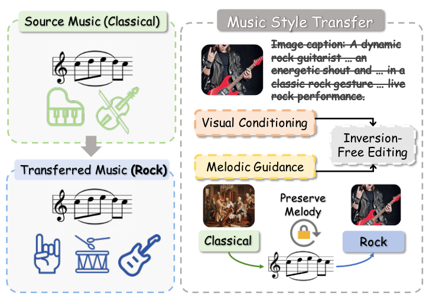

# 精读笔记 · Harmonic Canvas

Harmonic Canvas: Inversion-Free Editing for Visually-Guided Music Style Transfer

- 作者：Yue Lei、Siqi Yang、Ting Zhong、Fan Zhou。
- 机构：电子科技大学信息与软件工程学院；四川省智能数字媒体技术重点实验室。
- 发表：CVPR 2026，29727–29737 页。
- 输入：原始音乐 + 目标风格图片 + 文字条件；输出：改变风格而尽量保留旋律的音乐。
- 资料依据：用户提供的 CVF 正文 PDF（11 页）与 CVF 官方补充材料（13 页）。
- 核查日期：2026-10-08。
- 公开情况：官方演示网站和展示仓库可访问；已检查仓库根目录，仅发现网页、展示图像和音频等资源，没有发现模型训练/推理代码、模型权重或整理后数据集的下载入口。不能把展示网站当成模型代码开源。
- 项目：https://yesq11.github.io/Harmoni-Canvas/
- 展示仓库：https://github.com/YesQ11/Harmoni-Canvas
- 展示仓库版本：00ac13a5a6c5f33796fe856e17f9483f1bab5542。
- 未找到原始 LaTeX 源码；正文和附录文本是 PDF 抽取，公式须对照原始 PDF，不能把抽取中的符号乱码作为原公式。

## 导读地图

| 阶段 | 要讲清楚的问题 | 图表 | 依据 | 代码状态 |
|---|---|---|---|---|
| ① 动机 | 为什么音乐编辑既需要图像风格条件，又需要旋律约束？ | 正文图 1 | 正文 §1–3，PDF 1–3 页 | 无模型实现 |
| ② 架构 | MAA3、文字编码、CLIP/ViT、cross-adapter 如何连接？ | 正文图 2 | 正文 §4.1，PDF 3–5 页；附录 A.3/A.4 | 无模型实现 |
| ③ 训练与编辑目标 | adapter 的训练与推理期 chroma 梯度校正有什么区别？ | 式 2、4–9，算法 1 | 正文 3–6 页；附录 A.1–A.3 | 对照论文伪代码 |
| ④ 数据 | 图像、文字、纯伴奏音乐三元组怎么构建？ | 附录图 6 | 正文 §5.1；附录 A.3，PDF 3 页 | 未公开预处理实现 |
| ⑤ 信息流 | 先编码源音频，再以速度差编辑，何时校正旋律？ | 正文图 2、图 4；附录式 18–22 | 正文算法 1；附录 A.2 | 对照论文伪代码 |
| ⑥ 具体例子 | 从古典钢琴到摇滚，完整走一次编辑过程 | 正文图 1，官方演示 | 正文方法；官方样例 | 使用明确标注的示意数值，不能伪称真实运行 |
| ⑦ 实验 | 风格一致性与旋律保留如何权衡？ | 正文表 1–4；附录表 5–6 | 正文 §5；附录 A.4/A.5 | 无模型复现实验 |

## ① 动机

### 任务是什么

输入一段已经存在的音乐，把它重新演绎为另一种风格。例如，输入古典钢琴曲，再给一张摇滚现场图片与摇滚风格文字条件，希望输出保留原曲旋律线索的摇滚版本。

图 1 左边上、下两块是古典源音乐和摇滚编辑结果，音符形状相似而乐器图标变化；右上是视觉风格条件，右下的锁强调旋律约束，中间的 inversion-free editing 执行编辑。被划掉的 caption 表示不必把图片完全压缩成文字后再输入，不表示文字对所有设置都无用。

### 原有办法的两个困难

1. 图片转一句 caption 会漏掉色调、光照、构图和氛围等细节。两个画面都能被描述为“有人弹吉他”，却可能分别是安静的独奏与激烈的演出。作者主张让模型直接读取图片特征，与文字条件互补，而不是仅靠 caption。
2. 风格改得强，原曲也可能跟着变：换了音色和编曲，却连音高轨迹都改掉。反演编辑还需要额外恢复源样本的噪声/隐变量轨迹；作者采用 inversion-free 速度差编辑，叠加旋律校正。注意：不应把“所有扩散反演都随机”当作通用事实，确定性反演方法也存在。

### 作者的关键想法

把两个控制目标分开：视觉与文字告诉模型“向哪种风格改”，源音频的 chroma 告诉模型“哪些音高类别分布要尽量保持”。在潜空间编辑过程中，不仅施加风格方向，还重复做 chroma 梯度校正。

chroma 是每个时间帧中 C、C♯、D……B 十二种音级的相对能量分布。例如 C4 和 C5 都合并到 C 类。因此它比原始波形更能容忍换乐器或改变部分音域，同时保留调性和和声线索；它不等于完整旋律，也无法单独保证所有节奏和主旋律细节不变。

### 具体例子（示意，未运行模型）

源曲的短句是 C–D–E–G。用户希望换成电吉他、鼓组和更强的摇滚氛围。只追求“像摇滚”可能得到另一段不相关的摇滚旋律；这篇论文还会比较编辑后音频与源曲的 chroma，以减少音高结构漂移。理想结果是“还是认得出原来的短句，但演奏风格变了”，而不是复制原始波形。

### 证据与边界

- 正文表 3/4：不加旋律校正的 FlowEdit 为 CCS 0.852，加本方法校正后为 0.878；IMSM 从 0.829 变为 0.828。说明在作者设置中旋律相似度提高，而视觉风格一致性略降，存在权衡。
- 正文表 2：图像单独条件 FAD 4.06；文字+图像 FAD 2.43。图像在该实验中主要作为文字的补充，不能把宣传图理解为任何图像单独输入都足够。
- 以上均为论文报告，尚未独立运行复现。

一句话回顾：Harmonic Canvas 用图像与文字确定“怎么改风格”，再用源音乐的 chroma 约束减少“改得不像原曲”。

下一阶段：② 架构——拆解图 2 中音频主干、图文 cross-adapter 和旋律校正的连接方式。

## ②–⑥ 待逐阶段讲解

后续随对话补齐，不将未讲解部分伪称已完成。

## 后续需要核对的实现细节

- 附录 A.3 说明主干冻结，仅训练 adapter，20 epochs；正文给主干 1.5B、adapter 46.2M，batch size 16、学习率 1e-5，L40S GPU。
- 正文 25 步推理，旋律校正每外层步内做 2 步，η=1e-4、λ=1；附录给 tmax=23、tmin=15，需说明其为离散时间步配置而非直接作为 [0,1] 连续时间。
- 约 15k 三元组、16 个流派；8:1:1 划分；Demucs 去人声；GPT-4 两次一致流派分类与 caption 结构化。没有已核验的采样率、片段秒数和完整张量尺寸，不补写猜测值。
- 算法 1 与正文 §4.2 对 reference chroma 的写法不同；需在信息流阶段明确差异。
- 正文表 2 的 caption 设置 FAD 3.49 差于 text-only 3.15，与正文“slightly improve”措辞不一致。
- 附录的理论性 flow/rectified-flow 描述不能直接当作本方法的全部代码定义；缺少实现时按原文标明歧义。
- 附录用户研究界面使用 0–10 滑杆，结果以 0–100 汇报，需要核对是否只是换算。

## 问答

尚无针对论文内容的问答。
