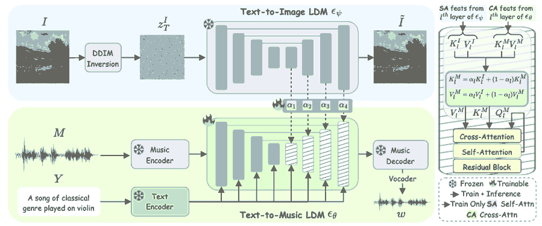

# 精读笔记：MeLFusion

2026-10-08阅读。依据用户提供的21页PDF（含附录）、arXiv 2406.04673v1源码，以及官方代码commit `c450b1da41c581701595a18f7ddaed33792cf3d7`。未执行代码、未下载权重、未听评样例。教学数值均为示意。

## 基本情况与导读地图

Sanjoy Chowdhury、Sayan Nag、K J Joseph、Balaji Vasan Srinivasan、Dinesh Manocha；Maryland、Toronto、Adobe Research。CVPR2024 Highlight。输入图片和文字，输出匹配二者的音乐。图片提供情境，文字可以指定乐器或类型；任务不是保留某条输入音乐的旋律，也不是视频逐帧配乐。

| 部分 | 原文位置 | 代码 |
|---|---|---|
| 动机 | p1–2、图1 | README |
| 架构 | §3、图2、式5–6 | models.py、attention_processor.py |
| 训练 | 式7、附录D | models.py:235、train_combined.py |
| 数据 | §4.1、附录F | 训练脚本的数据路径 |
| 信息流 | 算法1–2 | models.py:336 |
| 例子与实验 | 表1–7、附录E | 仅静态核查，无运行复现 |

## ① 动机：图像中的补充语义进入音乐模型

给一张夜空村庄图，配文字“柔和的小提琴音乐”。文字指乐器，图片还能传达静谧、色彩、空间等情境。先用caption模型把图变成长文字会丢信息，也可能引入和训练描述不一致的文本。作者利用图像扩散模型内部的视觉表示，把它注入音乐扩散模型，而非只拼一条图片caption。

图像语义和音乐情绪存在主观、多解关系，模型只能学习数据中的对应偏好，不意味着图里每一处颜色都有确定频率或旋律。该任务和EFTTS的语音情绪条件不同，也和暖初始化的“保留原音符”目标不同。

## ② 架构：冻结图像扩散，训练音乐扩散与融合



图2上方蓝色分支是冻结text-to-image LDM，下方绿色是text-to-music LDM。左侧图片先DDIM inversion获得起始图像潜变量；图像去噪分支产生视觉注意力特征，经绿色连接进入音乐分支解码块。下方训练时用真实音乐，推理时从噪声采样音乐。右侧小图说明key/value融合。

| 模块 | 来源/参数更新 | 作用 |
|---|---|---|
| 图像编码与图像LDM | Stable Diffusion，冻结 | 反演并产生视觉表示 |
| 文本编码器 | FLAN-T5，冻结 | 提供音乐文字条件 |
| 音乐VAE编解码 | AudioLDM系，冻结 | 梅尔与音乐潜空间转换 |
| 音乐UNet | Tango系预训练初始化，训练 | 预测音乐潜变量噪声 |
| α_l | 每decoder block可学习 | 控制视觉信息混入比例 |
| HiFiGAN | 既有声码器 | 频谱转波形 |

论文架构是3个encoder与3个decoder blocks。音乐潜变量形式C×(E/r)×(F/r)，E为时间、F为频率、r为压缩比；没有从本文核实到所有具体常数，不补成固定latent尺寸。不能把“额外融合参数少”解读成只训练3个标量：正文式7明确音乐θ与α一起训练。

## ③ 训练：视觉条件改变音乐噪声预测

```text
z_t = sqrt(γbar_t) z_clean + sqrt(1−γbar_t) ε
K_mix = α_l K_image + (1−α_l) K_music
V_mix = α_l V_image + (1−α_l) V_music
L = E ||ε − ε_θ(z_t,text,t,image_features)||²
```

α_l按论文描述是层级凸组合系数；K/V是注意力的key/value，不是原始图片像素或音频采样值。Q来自当前音乐状态。视觉特征改变网络关注的条件，网络仍通过噪声预测学会生成音乐，不是把图片向量直接解码成音乐。

教学简化取K_image=[2,0]、K_music=[0,2]、α=0.25，则K_mix=[0.5,1.5]。α=0是纯文字音乐条件，α=1是完全视觉来源；后者也不意味着音乐内容无须训练。若真实噪声[0.2,−0.4]、预测[0.1,−0.1]，平方误差和0.01+0.09=0.10。

附录D报告30epochs、AdamW、4张A100、42小时；表3α学习率1e−5效果最好。默认推理400去噪steps、CFG7（表5）。400不代表400音符；图像反演/图像去噪还产生额外成本，不能只用音乐步数估计完整时延。

算法2的 `z_t ← z_t − ε_θ(...)` 是高度简化的采样伪代码；实际DDIM/DDPM需噪声调度系数，不能逐字照它当可运行采样器。

## ④ 数据：每条是图片、文字、10秒音乐

MeLBench11,250三元组，15种genre，18位至少5年练习经历的音乐标注员，从YouTube挑10秒片段、图像帧及最多3句自由描述，描述乐器、节奏、情绪、类型等。另给MusicCaps音频文字对补充合适图片，其中图片也可能从网页获取，不必来自相同录制场景。

| 字段 | 单位/表示 | 作用 |
|---|---|---|
| image | RGB图像 | 情境线索 |
| caption | 最多3句文本 | 乐器、类型、节奏、情绪 |
| music | 10秒波形 | 监督目标 |
| genre | 15类之一 | 数据组织及分组分析 |

监督来自人为认为匹配的三元组，并非天然物理音画同步。自然图、动画、海报、绘画/草图均包含（表16）。原文样本数量11,250与表16图像类型计数之和11,450存在冲突，计数对应比例也更接近11,450；应记录差异，不自行“修正”为一个精确新总数。本文未在笔记中补造划分比例或声学采样率。

## ⑤ 输入输出信息流：论文预期链

```text
图片 → image encoder → DDIM inversion → z_image,T
文字 → FLAN-T5 → text embedding
音乐初始高斯噪声 z_music,T
每个去噪时间：
  冻结图像UNet → 对应decoder层视觉K/V
  音乐UNet当前状态 + 文字K/V + 视觉K/V融合 → 噪声预测
  scheduler更新音乐状态（图像分支也沿其轨迹更新）
循环结束 → AudioVAE decoder → mel → HiFiGAN → 波形
```

图像特征随去噪层和时间变化，不是只计算一次CLIP全局向量。图片输入没有原音乐，故无需保留指定旋律。为比较输入控制，固定文字与随机种子换图，才能较好隔离图片的作用；这属于读者实验建议，本文笔记没有执行。

## ⑥ 玩具例子与真实代码核查

设图片为森林夜景，文字为“柔和的小提琴音乐”。按论文，反演图片得到z_image,T，文本一次编码；从音乐噪声开始，某decoder层用α=0.25将视觉与文字K/V融合；第一轮得到新音乐latent，第二轮用更新后的latent及该时间的视觉特征继续，直至解码。向量混合例见③；无法从论文给定信息逐项算出真实音符。

**必须区分当前公开代码和上面论文链**：核查commit `c450b1d...`，静态可直接看到以下差异。

1. `models.py:235–273`训练图像支路取VAE图像latent并加随机噪声，不是明确调用DDIM inversion。
2. `models.py:336–370`推理函数接收 `img_tensors`，但该函数内图像latent由 `torch.randn(...,4,64,64)` 初始化，没有使用传入图片；`inference.py:219–236`确实读取并传图，因而问题发生在调用之后。当前路径更像从文字生成图像支路再辅助音乐，不能保证结果跟参考图片一致。
3. `diffusers/src/diffusers/models/attention_processor.py:513–575`用factor=(2 sigmoid(α)−1)/5，在外部hidden states与文本hidden states间混合，再投影K/V；factor范围约(−0.2,0.2)，不是正文α∈[0,1]的K/V凸组合。外部特征还经过adaptive pooling以匹配尺寸。
4. `models.py:310–316`先对batch的target及prediction取均值再算MSE，与通常逐样本噪声MSE不同；不应省略该差异来声称精确复现式7。
5. `train_mmgen.sh`当前默认80epochs、learning_rate1e−6、snr_gamma5；论文是30epochs且α学习率表述1e−5。`tango.py`还有硬编码本地checkpoint路径，不能保证下载基础Tango权重就能运行本文系统。

这些结论局限于核查commit的静态路径；未运行，未覆盖所有可能替代入口，也不据此推断论文实验使用了哪个私有版本。

## ⑦ 实验、指标与局限

表1MeLBench：MusicGen FAD3.28，MeLFusion1.05，下降(3.28−1.05)/3.28≈67.99%，论文报67.98%（舍入差异）；OVL84.61→88.45，REL83.25→87.39。更接近条件公平的TANGO++ FAD2.93，仍高于1.05。MusicCaps上MeLFusion FAD1.12。

表4单文字FAD3.11、单图片4.16、图文1.05（MeLBench）；表14固定α=0.5时FAD1.12，learnableα1.05，说明学习权重有增益，但相比中间固定值没有摘要大百分比那么夸张。

IMSM公式是 `A_IMSM = A_CLIP × A_CLAP^T`，以共同文字集合桥接图像与音乐。它不是直接对齐的图像/音频单向量cosine；结果依赖候选文字集合及编码器。作者64人研究报告平均IMSM/人工分数MeLBench0.83/0.85；均值接近本身不足以证明样本级高相关，需要相关系数或更完整分析。

还需注意：FAD是生成集与真实集的分布距离，不需要一一配对，但仍需要参考分布；不能理解“无配对reference”为不需要任何reference。本文FAD使用VGG-like表征，暖初始化论文使用CLAP，数值不能跨论文直接排名。文本模型与图文模型条件不同，附录C也承认比较不完全公平。图像音乐匹配主观、数据可能有艺术类型偏差；10秒片段与当前基准不能证明长曲结构或视频时序能力。

## 来源与开放范围

- [论文](https://arxiv.org/abs/2406.04673) · [项目页](https://schowdhury671.github.io/melfusion_cvpr2024/)
- [官方代码](https://github.com/schowdhury671/melfusion)，commit如上；保存本次实际阅读的代码与其许可证/来源，未声称完整模型权重可得。
- 数据入口由项目页链接提供，未下载全集，也未核实其当前访问权限；不能把链接存在当成已成功获得数据。
- 原始PDF及大源文件的上传范围见 `upload-status.md`。
